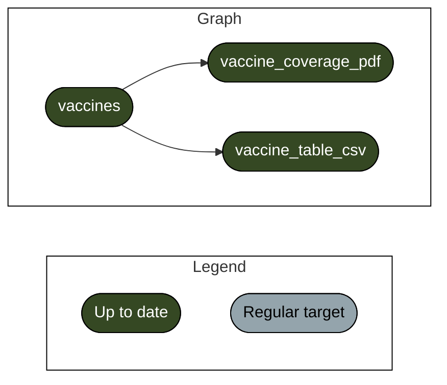

```mermaid
graph LR
  style Legend fill:#FFFFFF00,stroke:#000000;
  style Graph fill:#FFFFFF00,stroke:#000000;
  subgraph Legend
    xf1522833a4d242c5(["Up to date"]):::uptodate
    xd03d7c7dd2ddda2b(["Regular target"]):::none
  end
  subgraph Graph
    direction LR
    xfd9926cd5e5d5e15(["vaccines"]):::uptodate --> xbe646dd4dc3174b9(["vaccine_coverage_pdf"]):::uptodate
    xfd9926cd5e5d5e15(["vaccines"]):::uptodate --> x3efd8bf115a451dc(["vaccine_table_csv"]):::uptodate
    
  end
  classDef uptodate stroke:#000000,color:#ffffff,fill:#354823;
  classDef none stroke:#000000,color:#000000,fill:#94a4ac;
```
