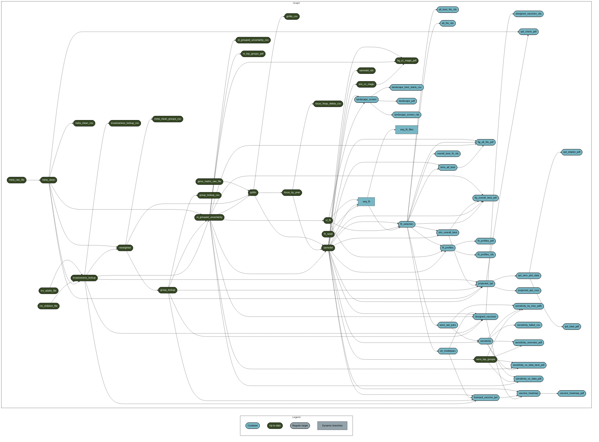

```mermaid
graph LR
  style Legend fill:#FFFFFF00,stroke:#000000;
  style Graph fill:#FFFFFF00,stroke:#000000;
  subgraph Legend
    x2db1ec7a48f65a9b(["Outdated"]):::outdated
    xf1522833a4d242c5(["Up to date"]):::uptodate
    xd03d7c7dd2ddda2b(["Regular target"]):::none
    x6f7e04ea3427f824["Dynamic branches"]:::none
  end
  subgraph Graph
    direction LR
    xfd2550717fd60977(["fit_selection"]):::outdated --> x3ef6dce1599bf024(["all_best_fits_rds"]):::outdated
    xfd2550717fd60977(["fit_selection"]):::outdated --> xfecf98441c1e3263(["all_fits_rds"]):::outdated
    xa01e651e7c0bb238(["group_lookup"]):::uptodate --> x5f5d8068cf864431(["designed_vaccines"]):::outdated
    xda339c40f9e920f9(["invasiveness_lookup"]):::uptodate --> x5f5d8068cf864431(["designed_vaccines"]):::outdated
    xf04eb5698bfb1839(["xt_grouped_uncertainty"]):::uptodate --> x5f5d8068cf864431(["designed_vaccines"]):::outdated
    x14746801bbba9277(["samodel"]):::uptodate --> x5f5d8068cf864431(["designed_vaccines"]):::outdated
    x842bef5bc1e15747(["vd_modelpars"]):::outdated --> x5f5d8068cf864431(["designed_vaccines"]):::outdated
    x5f5d8068cf864431(["designed_vaccines"]):::outdated --> x7b839e36088b4e88(["designed_vaccines_rds"]):::outdated
    x85ac8e09811d31f1(["sims_all_best"]):::outdated --> x8bed148e06117154(["fig_all_fits_pdf"]):::outdated
    xf04eb5698bfb1839(["xt_grouped_uncertainty"]):::uptodate --> x8bed148e06117154(["fig_all_fits_pdf"]):::outdated
    xfd2550717fd60977(["fit_selection"]):::outdated --> x8bed148e06117154(["fig_all_fits_pdf"]):::outdated
    x14746801bbba9277(["samodel"]):::uptodate --> x8bed148e06117154(["fig_all_fits_pdf"]):::outdated
    xff8da266c27e59d7(["sim_cc_magic"]):::uptodate --> x9f3c1421c684630f(["fig_cc_magic_pdf"]):::uptodate
    xf04eb5698bfb1839(["xt_grouped_uncertainty"]):::uptodate --> x9f3c1421c684630f(["fig_cc_magic_pdf"]):::uptodate
    x14746801bbba9277(["samodel"]):::uptodate --> x9f3c1421c684630f(["fig_cc_magic_pdf"]):::uptodate
    xfd2550717fd60977(["fit_selection"]):::outdated --> xb3a5a0cce2aa3a04(["fig_overall_best_pdf"]):::outdated
    x14746801bbba9277(["samodel"]):::uptodate --> xb3a5a0cce2aa3a04(["fig_overall_best_pdf"]):::outdated
    x014c03017d3725a8(["sim_overall_best"]):::outdated --> xb3a5a0cce2aa3a04(["fig_overall_best_pdf"]):::outdated
    xf04eb5698bfb1839(["xt_grouped_uncertainty"]):::uptodate --> xb3a5a0cce2aa3a04(["fig_overall_best_pdf"]):::outdated
    x14746801bbba9277(["samodel"]):::uptodate --> x073bd4e624965c7c(["fit_profiles"]):::outdated
    x329b4654fae57f7f(["xt_fit"]):::uptodate --> x073bd4e624965c7c(["fit_profiles"]):::outdated
    xfd2550717fd60977(["fit_selection"]):::outdated --> x073bd4e624965c7c(["fit_profiles"]):::outdated
    x073bd4e624965c7c(["fit_profiles"]):::outdated --> xe977b5b3f6f20302(["fit_profiles_pdf"]):::outdated
    x073bd4e624965c7c(["fit_profiles"]):::outdated --> xd6536f9b4760e987(["fit_profiles_rds"]):::outdated
    x044e717d778906e5["seq_fit"]:::outdated --> xfd2550717fd60977(["fit_selection"]):::outdated
    x329b4654fae57f7f(["xt_fit"]):::uptodate --> xfd2550717fd60977(["fit_selection"]):::outdated
    x14746801bbba9277(["samodel"]):::uptodate --> xfd2550717fd60977(["fit_selection"]):::outdated
    xf04eb5698bfb1839(["xt_grouped_uncertainty"]):::uptodate --> xa5760c5bc73e4128(["gnfds"]):::uptodate
    xc67d91f30d07e5b6(["reweighted"]):::uptodate --> xa5760c5bc73e4128(["gnfds"]):::uptodate
    x99b63b77a43654ff(["gene_matrix_raw_file"]):::uptodate --> xa5760c5bc73e4128(["gnfds"]):::uptodate
    xa5760c5bc73e4128(["gnfds"]):::uptodate --> x16f8d6f9683a028b(["gnfds_csv"]):::uptodate
    xc67d91f30d07e5b6(["reweighted"]):::uptodate --> xa01e651e7c0bb238(["group_lookup"]):::uptodate
    xa01e651e7c0bb238(["group_lookup"]):::uptodate --> xc51efbb84df52025(["group_lookup_csv"]):::uptodate
    x420b1db39d30e633(["meta_clean"]):::uptodate --> xda339c40f9e920f9(["invasiveness_lookup"]):::uptodate
    x35f2761c89691837(["inv_children_file"]):::uptodate --> xda339c40f9e920f9(["invasiveness_lookup"]):::uptodate
    x301fcf581bad9803(["inv_adults_file"]):::uptodate --> xda339c40f9e920f9(["invasiveness_lookup"]):::uptodate
    xda339c40f9e920f9(["invasiveness_lookup"]):::uptodate --> x2643501e42399705(["invasiveness_lookup_csv"]):::uptodate
    xc1bd415eeca04222(["projected_ipd"]):::outdated --> x9e4014806d039e4b(["ipd_check_pdf"]):::outdated
    x420b1db39d30e633(["meta_clean"]):::uptodate --> x9e4014806d039e4b(["ipd_check_pdf"]):::outdated
    x88a2ca925f6d3c15(["ipd_sero_plot_data"]):::outdated --> x35e92d1d76f22339(["ipd_dotplot_pdf"]):::outdated
    xc1bd415eeca04222(["projected_ipd"]):::outdated --> x88a2ca925f6d3c15(["ipd_sero_plot_data"]):::outdated
    x88a2ca925f6d3c15(["ipd_sero_plot_data"]):::outdated --> xafa7e1dd6f11f2e3(["ipd_total_pdf"]):::outdated
    x8975b003369fdf02(["landscape_screen"]):::outdated --> xc947326175ee1014(["landscape_best_starts_csv"]):::outdated
    x8975b003369fdf02(["landscape_screen"]):::outdated --> x18aae99264d329bf(["landscape_pdf"]):::outdated
    x329b4654fae57f7f(["xt_fit"]):::uptodate --> x8975b003369fdf02(["landscape_screen"]):::outdated
    x14746801bbba9277(["samodel"]):::uptodate --> x8975b003369fdf02(["landscape_screen"]):::outdated
    x8975b003369fdf02(["landscape_screen"]):::outdated --> x56ba43d9ccdd1cb3(["landscape_screen_rds"]):::outdated
    xda339c40f9e920f9(["invasiveness_lookup"]):::uptodate --> x21410171f208fe32(["licensed_vaccine_ipd"]):::outdated
    xa01e651e7c0bb238(["group_lookup"]):::uptodate --> x21410171f208fe32(["licensed_vaccine_ipd"]):::outdated
    x842bef5bc1e15747(["vd_modelpars"]):::outdated --> x21410171f208fe32(["licensed_vaccine_ipd"]):::outdated
    x14746801bbba9277(["samodel"]):::uptodate --> x21410171f208fe32(["licensed_vaccine_ipd"]):::outdated
    xa5760c5bc73e4128(["gnfds"]):::uptodate --> x73436ea5ec5a4c0a(["locus_by_year"]):::uptodate
    x73436ea5ec5a4c0a(["locus_by_year"]):::uptodate --> xd5e6643f4a679d5b(["locus_freqs_deltas_csv"]):::uptodate
    xf29eaf0771d0c032(["meta_raw_file"]):::uptodate --> x420b1db39d30e633(["meta_clean"]):::uptodate
    x420b1db39d30e633(["meta_clean"]):::uptodate --> x40de07cba01e737f(["meta_clean_csv"]):::uptodate
    xc67d91f30d07e5b6(["reweighted"]):::uptodate --> xf8a94d74ecd37366(["meta_clean_groups_csv"]):::uptodate
    xfd2550717fd60977(["fit_selection"]):::outdated --> xe7b3ccfae08cd183(["overall_best_fit_rds"]):::outdated
    x14746801bbba9277(["samodel"]):::uptodate --> xc1bd415eeca04222(["projected_ipd"]):::outdated
    x420b1db39d30e633(["meta_clean"]):::uptodate --> xc1bd415eeca04222(["projected_ipd"]):::outdated
    xa01e651e7c0bb238(["group_lookup"]):::uptodate --> xc1bd415eeca04222(["projected_ipd"]):::outdated
    x014c03017d3725a8(["sim_overall_best"]):::outdated --> xc1bd415eeca04222(["projected_ipd"]):::outdated
    xda339c40f9e920f9(["invasiveness_lookup"]):::uptodate --> xc1bd415eeca04222(["projected_ipd"]):::outdated
    xc1bd415eeca04222(["projected_ipd"]):::outdated --> x00ef85b32bb3c5b7(["projected_ipd_csvs"]):::outdated
    xda339c40f9e920f9(["invasiveness_lookup"]):::uptodate --> xc67d91f30d07e5b6(["reweighted"]):::uptodate
    x420b1db39d30e633(["meta_clean"]):::uptodate --> xc67d91f30d07e5b6(["reweighted"]):::uptodate
    xf04eb5698bfb1839(["xt_grouped_uncertainty"]):::uptodate --> x14746801bbba9277(["samodel"]):::uptodate
    x73436ea5ec5a4c0a(["locus_by_year"]):::uptodate --> x14746801bbba9277(["samodel"]):::uptodate
    xa5760c5bc73e4128(["gnfds"]):::uptodate --> x14746801bbba9277(["samodel"]):::uptodate
    x14746801bbba9277(["samodel"]):::uptodate --> x9568aba524c6b4e7(["samodel_rds"]):::uptodate
    xfd2550717fd60977(["fit_selection"]):::outdated --> xf8d715e0673e6540(["sens_opt_pars"]):::outdated
    x14746801bbba9277(["samodel"]):::uptodate --> x6f1e2195923852bc(["sens_top_groups"]):::uptodate
    x14746801bbba9277(["samodel"]):::uptodate --> x60d50cad438fbb0b(["sensitivity"]):::outdated
    xf8d715e0673e6540(["sens_opt_pars"]):::outdated --> x60d50cad438fbb0b(["sensitivity"]):::outdated
    x6f1e2195923852bc(["sens_top_groups"]):::uptodate --> x3c45088ca4fcadf3(["sensitivity_by_loss_pdfs"]):::outdated
    x60d50cad438fbb0b(["sensitivity"]):::outdated --> x3c45088ca4fcadf3(["sensitivity_by_loss_pdfs"]):::outdated
    xf8d715e0673e6540(["sens_opt_pars"]):::outdated --> x3c45088ca4fcadf3(["sensitivity_by_loss_pdfs"]):::outdated
    x60d50cad438fbb0b(["sensitivity"]):::outdated --> xad6bd2d2e41c7f56(["sensitivity_failed_csv"]):::outdated
    x6f1e2195923852bc(["sens_top_groups"]):::uptodate --> x7a2d276e40975c17(["sensitivity_overview_pdf"]):::outdated
    x60d50cad438fbb0b(["sensitivity"]):::outdated --> x7a2d276e40975c17(["sensitivity_overview_pdf"]):::outdated
    x60d50cad438fbb0b(["sensitivity"]):::outdated --> xb9d78328ca571d5c(["sensitivity_vs_data_best_pdf"]):::outdated
    xf04eb5698bfb1839(["xt_grouped_uncertainty"]):::uptodate --> xb9d78328ca571d5c(["sensitivity_vs_data_best_pdf"]):::outdated
    x6f1e2195923852bc(["sens_top_groups"]):::uptodate --> xb9d78328ca571d5c(["sensitivity_vs_data_best_pdf"]):::outdated
    xf04eb5698bfb1839(["xt_grouped_uncertainty"]):::uptodate --> x5755c4d25e5a10fc(["sensitivity_vs_data_pdf"]):::outdated
    x6f1e2195923852bc(["sens_top_groups"]):::uptodate --> x5755c4d25e5a10fc(["sensitivity_vs_data_pdf"]):::outdated
    x60d50cad438fbb0b(["sensitivity"]):::outdated --> x5755c4d25e5a10fc(["sensitivity_vs_data_pdf"]):::outdated
    xec6de714bf10c7a8(["fit_seed"]):::uptodate --> x044e717d778906e5["seq_fit"]:::outdated
    x14746801bbba9277(["samodel"]):::uptodate --> x044e717d778906e5["seq_fit"]:::outdated
    x329b4654fae57f7f(["xt_fit"]):::uptodate --> x044e717d778906e5["seq_fit"]:::outdated
    x044e717d778906e5["seq_fit"]:::outdated --> x9fb690d4a8e0503c["seq_fit_files"]:::outdated
    x14746801bbba9277(["samodel"]):::uptodate --> xff8da266c27e59d7(["sim_cc_magic"]):::uptodate
    x14746801bbba9277(["samodel"]):::uptodate --> x014c03017d3725a8(["sim_overall_best"]):::outdated
    xfd2550717fd60977(["fit_selection"]):::outdated --> x014c03017d3725a8(["sim_overall_best"]):::outdated
    xfd2550717fd60977(["fit_selection"]):::outdated --> x85ac8e09811d31f1(["sims_all_best"]):::outdated
    x14746801bbba9277(["samodel"]):::uptodate --> x85ac8e09811d31f1(["sims_all_best"]):::outdated
    x5f5d8068cf864431(["designed_vaccines"]):::outdated --> x5013d70c20495aa0(["vaccine_heatmap"]):::outdated
    x21410171f208fe32(["licensed_vaccine_ipd"]):::outdated --> x5013d70c20495aa0(["vaccine_heatmap"]):::outdated
    x14746801bbba9277(["samodel"]):::uptodate --> x5013d70c20495aa0(["vaccine_heatmap"]):::outdated
    x5013d70c20495aa0(["vaccine_heatmap"]):::outdated --> xcaed5589fca171ad(["vaccine_heatmap_pdf"]):::outdated
    xfd2550717fd60977(["fit_selection"]):::outdated --> x842bef5bc1e15747(["vd_modelpars"]):::outdated
    xf04eb5698bfb1839(["xt_grouped_uncertainty"]):::uptodate --> x329b4654fae57f7f(["xt_fit"]):::uptodate
    xda339c40f9e920f9(["invasiveness_lookup"]):::uptodate --> xf04eb5698bfb1839(["xt_grouped_uncertainty"]):::uptodate
    xa01e651e7c0bb238(["group_lookup"]):::uptodate --> xf04eb5698bfb1839(["xt_grouped_uncertainty"]):::uptodate
    x420b1db39d30e633(["meta_clean"]):::uptodate --> xf04eb5698bfb1839(["xt_grouped_uncertainty"]):::uptodate
    xf04eb5698bfb1839(["xt_grouped_uncertainty"]):::uptodate --> xf86df8884e42e9fa(["xt_grouped_uncertainty_csv"]):::uptodate
    xf04eb5698bfb1839(["xt_grouped_uncertainty"]):::uptodate --> x9747ebd78801d608(["xt_top_groups_pdf"]):::uptodate
    
  end
  classDef outdated stroke:#000000,color:#000000,fill:#78B7C5;
  classDef uptodate stroke:#000000,color:#ffffff,fill:#354823;
  classDef none stroke:#000000,color:#000000,fill:#94a4ac;
```
